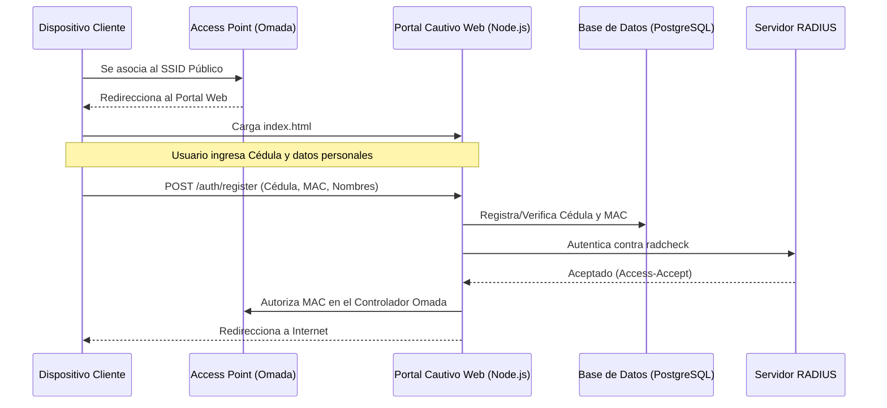
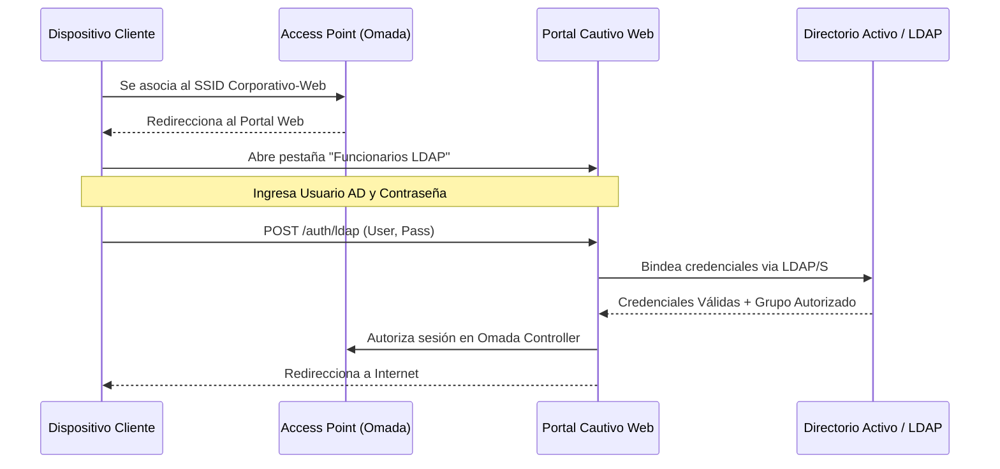
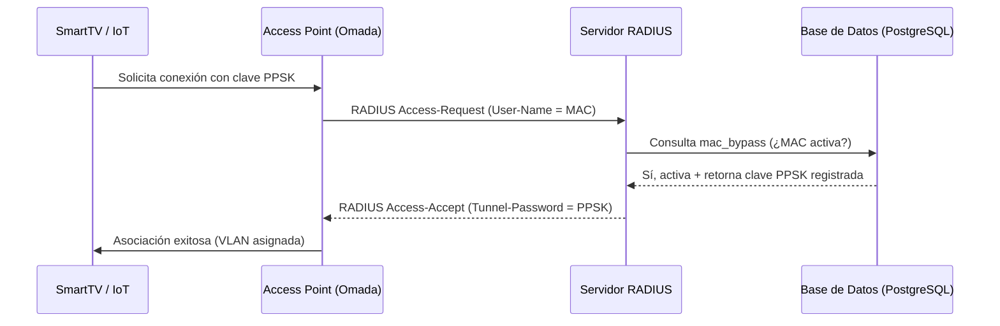
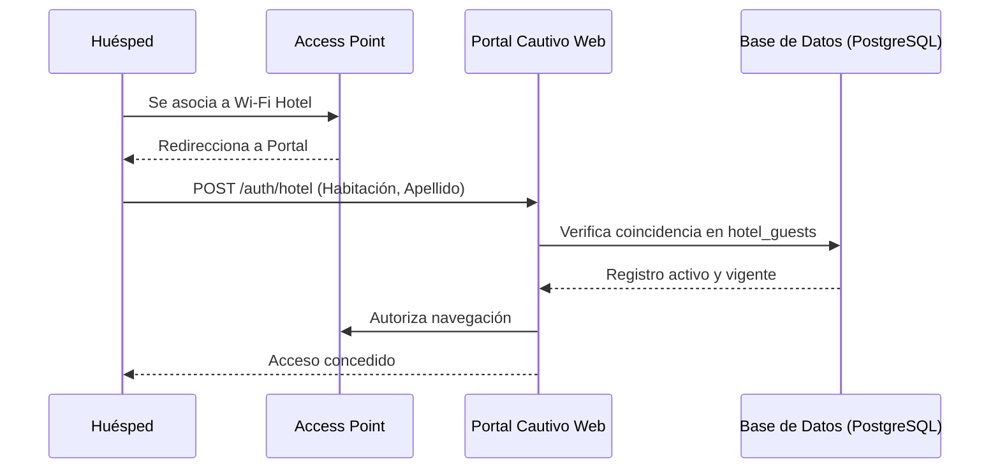
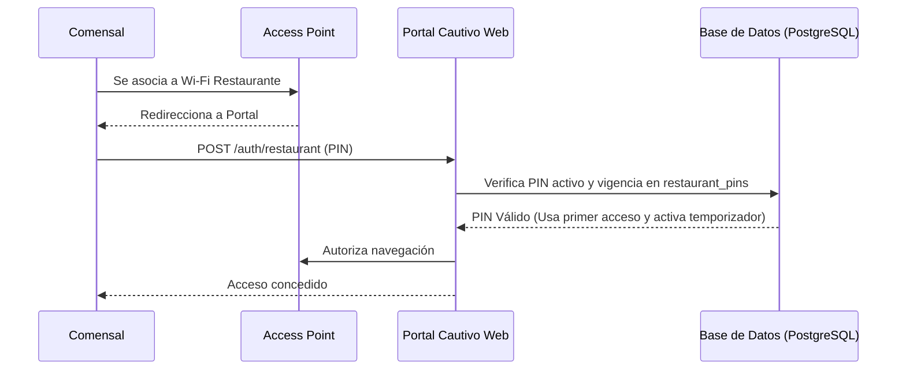

# Documentación Técnica: Métodos de Autenticación de Red

Este documento proporciona una guía técnica detallada de los 6 métodos de autenticación soportados por la plataforma del portal cautivo. Está diseñado para el personal técnico y administradores de sistemas.

---

## 1. Arquitectura General del Sistema

El portal cautivo integra tres componentes tecnológicos clave:
1.  **Controlador de Red (TP-Link Omada):** Administra los SSIDs, los Access Points y gestiona la redirección de los clientes no autenticados.
2.  **Servidor RADIUS (FreeRADIUS):** Maneja la autenticación y la contabilidad (`radacct`) en capa de red (MAB y 802.1X) y valida credenciales del portal web.
3.  **Base de Datos (PostgreSQL):** Almacena los perfiles de usuario, dispositivos registrados, bitácoras de acceso, estados de activación de métodos y tablas de control.

---

## 2. Resumen Comparativo de Métodos

| # | Método | Tipo de Interfaz | Protocolo | Tablas de Control (DB) | Casos de Uso / Destinatarios |
| :---: | :--- | :--- | :--- | :--- | :--- |
| **1** | **Autoregistro (Cédula)** | Portal Web | PAP / RADIUS | `usuarios_portal`, `dispositivos_usuario` | Ciudadanos, visitantes generales de la provincia. |
| **2** | **Portal LDAP** | Portal Web | LDAP + PAP | Configuración LDAP local | Funcionarios y contratistas de la institución. |
| **3** | **WPA Enterprise (802.1X)** | Nativo (SO) | PEAP-MSCHAPv2 | Directorio Activo (LDAP) | Dispositivos corporativos de funcionarios (PCs, Laptops). |
| **4** | **PPSK / MAC Bypass (MAB)** | Nativo (PPSK/MAB)| RADIUS (MAB) | `mac_bypass` | SmartTVs, impresoras, cámaras y dispositivos de red. |
| **5** | **Huéspedes de Hotel** | Portal Web | PAP / RADIUS | `hotel_guests` | Visitantes alojados en el complejo de hospedaje. |
| **6** | **PIN de Restaurante** | Portal Web | PAP / RADIUS | `restaurant_pins` | Clientes temporales del restaurante/cafetería. |

---

## 3. Detalle Técnico por Método

---

### Método 1: Autoregistro (Cédula)

Permite el acceso a internet a ciudadanos tras validar su número de cédula ecuatoriana y registrar los datos de su dispositivo.



#### Mockup de la Interfaz:
```text
┌──────────────────────────────────────────────────────────┐
│                      PORTAL WI-FI                        │
│                   Provincia de Pastaza                   │
├──────────────────────────────────────────────────────────┤
│  [ Termómetro de Conexión: Público General ]             │
│                                                          │
│  Por favor regístrese para acceder a internet:           │
│  ┌────────────────────────────────────────────────────┐  │
│  │ Cédula de Identidad: [ 1600617300                ] │  │
│  │ Nombres Completos:   [ Angel Vicente             ] │  │
│  │ Apellidos Completos: [ Velasco Pazmiño           ] │  │
│  │ Correo Electrónico:  [ angelvelpaz@gmail.com     ] │  │
│  └────────────────────────────────────────────────────┘  │
│  [X] Acepto los Términos y Condiciones de Uso.          │
│                                                          │
│                 ┌──────────────────────┐                 │
│                 │  REGISTRAR Y CONECTAR│                 │
│                 └──────────────────────┘                 │
└──────────────────────────────────────────────────────────┘
```

---

### Método 2: Portal LDAP (Inicio de Sesión Institucional)

Autentica a funcionarios mediante un formulario web conectado en tiempo real al Active Directory o servidor LDAP institucional.



#### Mockup de la Interfaz:
```text
┌──────────────────────────────────────────────────────────┐
│                      PORTAL WI-FI                        │
│                   Provincia de Pastaza                   │
├──────────────────────────────────────────────────────────┤
│  [ Termómetro de Conexión: Funcionarios ]                │
│                                                          │
│  Ingrese sus credenciales institucionales:               │
│  ┌────────────────────────────────────────────────────┐  │
│  │ Usuario AD:    [ angel.velasco                     ] │  │
│  │ Contraseña:    [ ****************                  ] │  │
│  └────────────────────────────────────────────────────┘  │
│                                                          │
│                    ┌────────────────┐                    │
│                    │  INICIAR SESIÓN│                    │
│                    └────────────────┘                    │
└──────────────────────────────────────────────────────────┘
```

---

### Método 3: WPA Enterprise (802.1X / PEAP)

Autenticación a nivel de hardware/red inalámbrica. El dispositivo solicita las credenciales directamente antes de conectarse al SSID, sin requerir portal cautivo.

```mermaid
sequenceDiagram
    participant Cliente as Dispositivo Cliente
    participant AP as Access Point (Omada)
    participant RADIUS as Servidor RADIUS
    participant LDAP as Directorio Activo / LDAP

    Cliente->>AP: Intenta asociarse al SSID Seguro (802.1X)
    AP->>RADIUS: RADIUS Access-Request (EAP-PEAP)
    RADIUS<->Cliente: Establece túnel TLS seguro
    Cliente->>RADIUS: Envía credenciales cifradas (MSCHAPv2)
    RADIUS->>LDAP: Consulta / Valida credenciales en AD
    LDAP-->>RADIUS: Usuario Válido
    RADIUS-->>AP: RADIUS Access-Accept + Atributos VLAN/VSA
    AP->>Cliente: Conexión inalámbrica establecida
```

*   **Ventaja clave:** Cifra todo el tráfico inalámbrico entre el cliente y el AP de manera individual (WPA2/WPA3 Enterprise).

---

### Método 4: PPSK / MAC Bypass (MAB)

Permite conectar dispositivos que no disponen de navegador web (cámaras, impresoras, IoT) mediante su dirección física MAC. Además, se apoya en claves privadas pre-compartidas (PPSK) asignadas en el controlador Omada.



---

### Método 5: Huéspedes de Hotel

Diseñado para complejos de hospedaje institucional. El cliente accede ingresando su número de habitación y su apellido registrado en la base de datos local.



#### Mockup de la Interfaz:
```text
┌──────────────────────────────────────────────────────────┐
│                      PORTAL WI-FI                        │
│                   Provincia de Pastaza                   │
├──────────────────────────────────────────────────────────┤
│  [ Termómetro de Conexión: Huéspedes del Complejo ]      │
│                                                          │
│  Ingrese los datos de su reserva:                        │
│  ┌────────────────────────────────────────────────────┐  │
│  │ Número de Habitación/Cabaña: [ 305                 ] │  │
│  │ Apellido del Titular:        [ Velasco             ] │  │
│  └────────────────────────────────────────────────────┘  │
│                                                          │
│                    ┌────────────────┐                    │
│                    │  VALIDAR ACCESO│                    │
│                    └────────────────┘                    │
└──────────────────────────────────────────────────────────┘
```

---

### Método 6: PIN de Restaurante

Mecanismo simplificado para comensales. Los usuarios obtienen un ticket impreso con un PIN de 6 dígitos que les otorga una duración de conexión restringida (ej: 2 horas).



#### Mockup de la Interfaz:
```text
┌──────────────────────────────────────────────────────────┐
│                      PORTAL WI-FI                        │
│                   Provincia de Pastaza                   │
├──────────────────────────────────────────────────────────┤
│  [ Termómetro de Conexión: Comensales / Cafetería ]      │
│                                                          │
│  Ingrese el PIN de internet impreso en su ticket:        │
│  ┌────────────────────────────────────────────────────┐  │
│  │ Ingrese su PIN de 6 dígitos:  [ 849204            ] │  │
│  └────────────────────────────────────────────────────┘  │
│                                                          │
│                    ┌────────────────┐                    │
│                    │ CONECTAR A RED │                    │
│                    └────────────────┘                    │
└──────────────────────────────────────────────────────────┘
```
